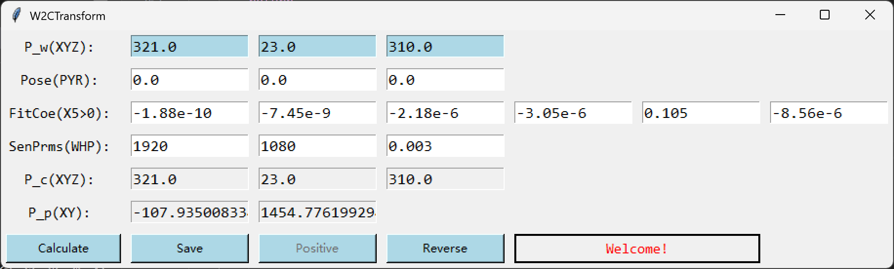

# W2CTransform

# 界面

## 参数
- P_w: 世界坐标 (X, Y, Z)
- Pose(PYR): 相机姿态 (Pitch, Yaw, Roll)
- FitCoe(X5>0): Real Height vs Angle 拟合函数参数, 从5阶->常数
- FitCoeR(X5>0): Angle vs Real Height
- SenPrms(WHP): Sensor参数 (Width, Height, Pixel Size)
- P_c: 相机坐标 (X, Y, Z)
- P_p: 像素/Sensor坐标 (X, Y) 

## 按键
- Calculte: 开始计算
- Save: 保存当前输入框的数据
- Positve: 进行世界坐标->像素坐标运算
- Reverse: 进行像素坐标->世界坐标运算
- Lock: 锁定输入框
- Unlock: 解锁输入框